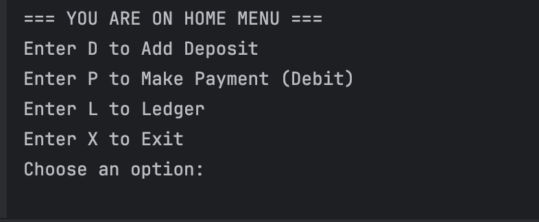
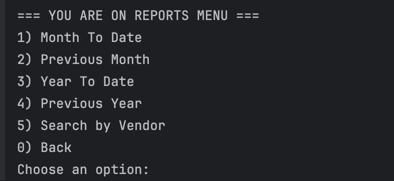
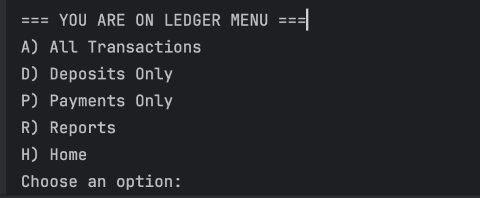

# **Accounting Ledger Application**

## 🚀 **Overview**

The **Accounting Ledger Application** is a CLI (Command-Line Interface) application 
designed to help users track and manage financial transactions for both business and personal use.

The application allows you to easily record deposits and payments, view detailed reports,
and manage your transaction data over different time periods

Transactions are saved in a **transactions.csv** format for easy access and portability.

---

## 🛠️ **Features**

- **💰 Add Transaction(HomeScreen)**
    - Users can record transactions as either deposits or payments (debits).

  ### 🏠 Home Screen
  Here is a screenshot of the home screen of the application:
  

- **📊 Transaction Reports(ReportsScreen)**
    - Users can generate detailed reports to track financial activities over various time periods.

  ### 🏠 Reports Screen
  Here is a screenshot of the Reports Screen of the application:
  

- **🔍 Filtering(LedgerScreen)**
    - Users can filter transactions to quickly view specific data.

  ### 🏠 Ledger Screen
  Here is a screenshot of the Ledger Screen of the application:
  


## 💻 **Technologies Used**

- **Java**: The primary programming language used for implementing the system.
- **CSV**: For data storage, ensuring portability and simplicity.
- **Java Time API**: To handle dates and times effectively.

---

## 🚀 **Getting Started**

### **🛠️ Prerequisites**

Before you start, ensure you have the following installed on your system:

- **Java Development Kit (JDK)** version 11 or higher

### **🔄 Clone the Repository**

To get started with the project, clone the repository using the following command:

```bash
git clone <https://github.com/karina-krupodior/capstone-1.git>
```

### **📂 Installation and Setup**

1. **Navigate to the project directory**:

   ```bash
   cd <project_folder>
   ```

2. **Build the Project**:  
   If you are using an IDE like IntelliJ IDEA or Eclipse, simply open the project and run it.  
   Alternatively, you can compile and run the `Main` class via the command line.

---

## ⚡ **Usage**

### **💵 Add a Deposit**

To record a deposit, create a `Transaction` object with a positive amount:

```java
Transaction deposit = new Transaction(LocalDate.now(), LocalTime.now(), "Deposit", "Supplier A", 100.00);
transactionService.addTransaction(deposit);
```

### **💳 Add a Payment (Debit)**

For payments, use a negative amount to indicate the debit:

```java
Transaction payment = new Transaction(LocalDate.now(), LocalTime.now(), "Payment", "Supplier B", -50.00);
transactionService.addTransaction(payment);
```

### **📈 Generate Transaction Reports**

You can generate reports by filtering the transactions based on the date or supplier. For example:

- **Get transactions for the current month**:

   ```java
   List<Transaction> currentMonthTransactions = transactionService.getTransactionsByDateRange(
       LocalDate.now().withDayOfMonth(1), LocalDate.now());
   ```

- **Get transactions for the previous month**:

   ```java
   List<Transaction> lastMonthTransactions = transactionService.getTransactionsByDateRange(
       LocalDate.now().minusMonths(1).withDayOfMonth(1), LocalDate.now().minusMonths(1).withDayOfMonth(30));
   ```

### **🔎 Filter Transactions**

You can also filter transactions by type:

- **Get all deposits**:

   ```java
   List<Transaction> deposits = transactionService.getDeposits();
   ```

- **Get all payments**:

   ```java
   List<Transaction> payments = transactionService.getPayments();
   ```

### **👥 Get Transactions by Supplier**

You can filter transactions by a specific supplier:

```java
List<Transaction> supplierTransactions = transactionService.getTransactionsBySupplier("Supplier A");
```

---

## 🗂️ **Project Structure**

The project follows a standard structure for clarity and modularity:

```
/capstone_1
    /src
        /main
            /java
                /model             # Contains the Transaction model and related classes
                /service           # Business logic for managing transactions
                /ui                # User interface logic and entry point
                /util              # Utility classes (e.g., for formatting)
    /resources
        /data                  # CSV files storing transactions
    README.md                  # Project documentation
```

---

## 🏗️ **Transaction Model**

The core of this application is the `Transaction` class. Here's a breakdown of the model:

### **💡 Transaction Class**

```java
public class Transaction {
    private final LocalDate date;
    private final LocalTime time;
    private final String description;
    private final String vendor;
    private final double amount;

    public Transaction(LocalDate date, LocalTime time, String description, String vendor, Double amount) {
        this.date = date;
        this.time = time;
        this.description = description;
        this.vendor = vendor;
        this.amount = amount;
    }

    // Getters and setters
}
```
---

## 💾 **How Transactions are Stored**

The transactions are stored in a CSV file to allow easy tracking and management.
Each transaction is saved in a row with the following columns:

- **Date**: The date the transaction was recorded.
- **Time**: The exact time of the transaction.
- **Description**: A brief description of the transaction type.
- **vendor**: The vendor's name involved in the transaction.
- **Amount**: The amount of the transaction (positive for deposits, negative for payments).

### **Example CSV File**:

```
Date,Time,Description,vendor,Amount
2025-04-25,10:00:00,Deposit,vendor A,150.00
2025-04-26,14:30:00,Payment,vendor B,-50.00
```

---

## 🤝 **Contributing**

We welcome contributions to improve the project. If you'd like to contribute, please follow these steps:

1. **Fork the repository**.
2. **Create a new branch**:
   ```bash
   git checkout -b feature/your-feature
   ```
3. **Commit your changes**:
   ```bash
   git commit -am 'Add new feature'
   ```
4. **Push to the branch**:
   ```bash
   git push origin feature/your-feature
   ```
5. **Open a pull request**.

---

## ✉️ **Contact**

For any questions or feedback, feel free to reach out to the maintainers via email or open an issue on GitHub.

---

## 🙏 **Acknowledgements**

- Special thanks to the open-source community for their invaluable contributions.
- This project was developed as part of a personal initiative by [Karina].

---

## 🌱 **Best Practices Followed**

- **Clear and structured documentation** to enhance user and developer experience.
- **Modular project structure** for maintainability.
- **Separation of concerns**: The business logic, model, and UI are in separate packages for clarity.
- **Meaningful variable and method names** for easy understanding of the code.

